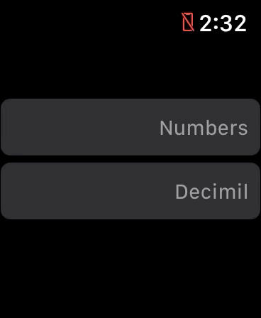

# SwiftUI Apple Watch Decimal Pad

With SwiftUI currently, Apple has not provided a decimal keypad for watchOS. Nor have they provided the ability to switch input types on a `TextField()` for watchOS. This is my kinda dirty fix. 

##### Apple Watch 44mm


##### Apple Watch  38mm


## Installation Instructions
WatchOS also has a weird issue with Swift Packages where you have to manually add the framework to the Watch Extension. 


`File > Swift Packages > add Package Dependecy...`
paste [https://github.com/ApplebaumIan/SwiftUI-Apple-Watch-Decimal-Pad.git](https://github.com/ApplebaumIan/SwiftUI-Apple-Watch-Decimal-Pad.git) into the search bar. Once installed navigate to your Xcode Project and select the `General` tab. Select your watchOS Extension target and scroll to `Frameworks, Libraries, and Embedded Content` click the `+` button and add `SwiftUI Apple Watch Decimal Pad` framework. 

You should now be able to add `import SwiftUI_Apple_Watch_Decimal_Pad` to the top of your desired Swift file.

## Usage
```swift
import SwiftUI
import SwiftUI_Apple_Watch_Decimal_Pad
struct ContentView: View {
	@State public var presentingModal: Bool
	var body: some View {
		DigiTextView(placeholder: placeholder, 
			text: text,
			presentingModal: presentingModal
			)
	}
}
```

If you would like to set the alignment of the text withing the Textfield:
```diff
DigiTextView(placeholder: placeholder,
	text: text, 
	presentingModal: presentKeyboard,
+	alignment: .leading
	)
```

If you would like to use the Decimil Pad version of the keyboard:
```diff
DigiTextView(placeholder: placeholder,
	text: text, 
	presentingModal: presentKeyboard,
	alignment: .leading,
+ 	style: .decimal
	)
```

